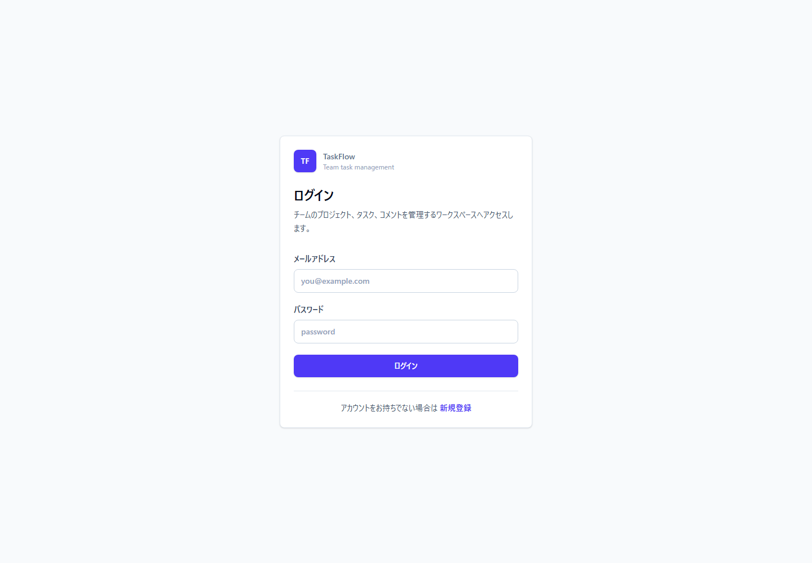
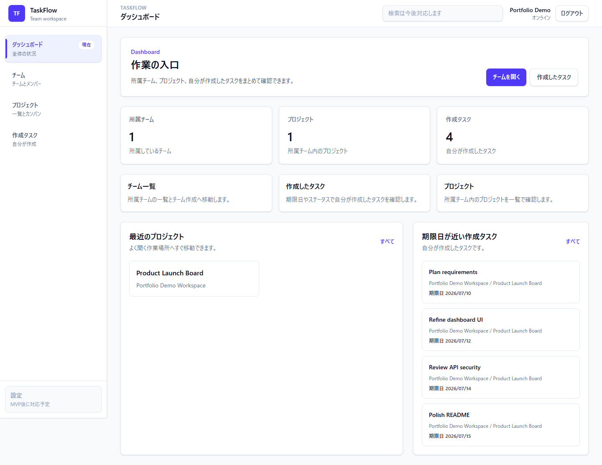
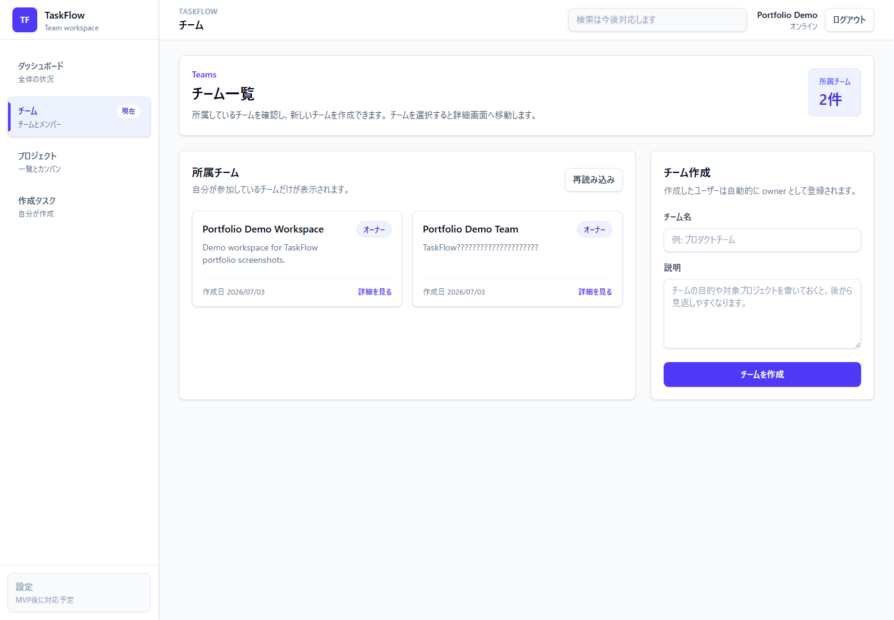
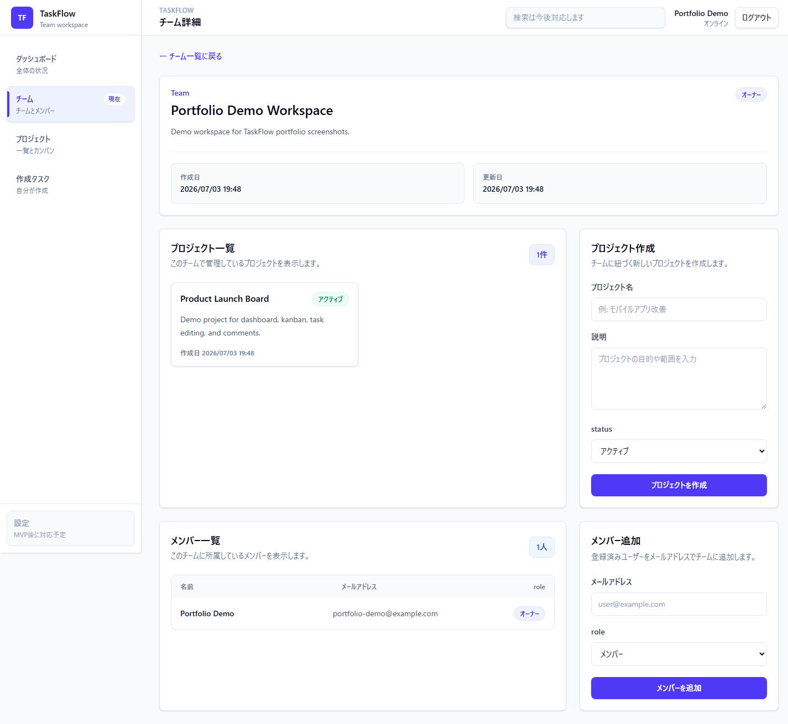
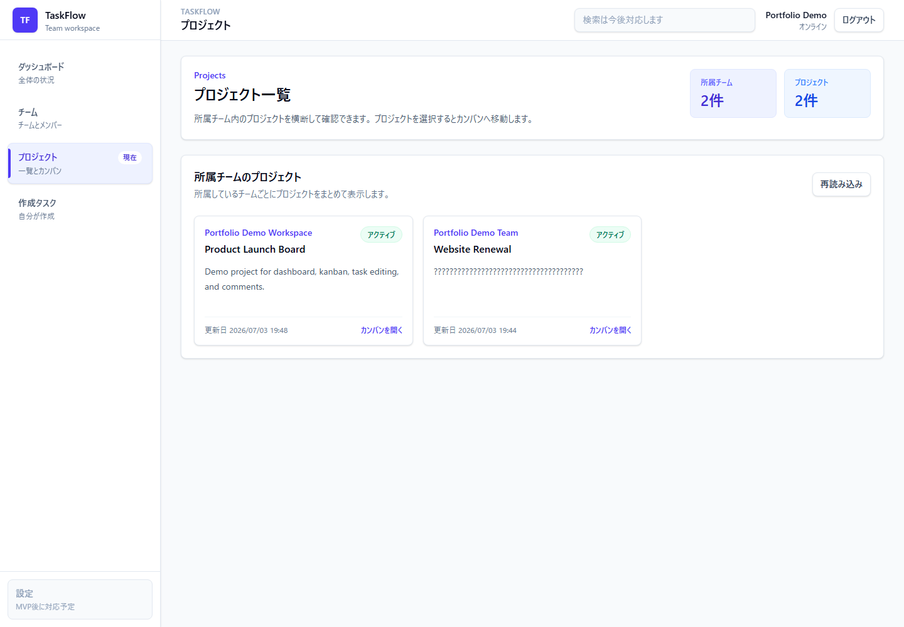
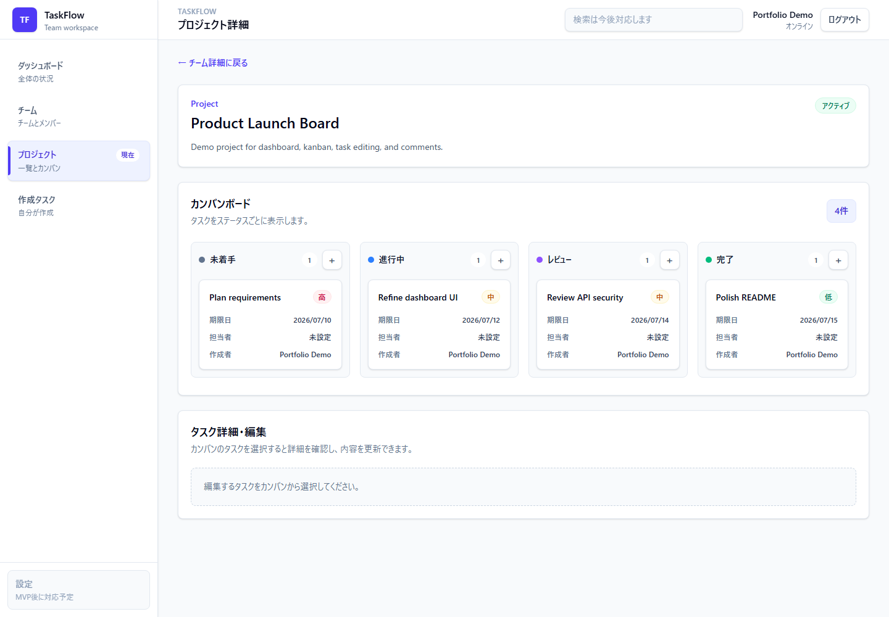
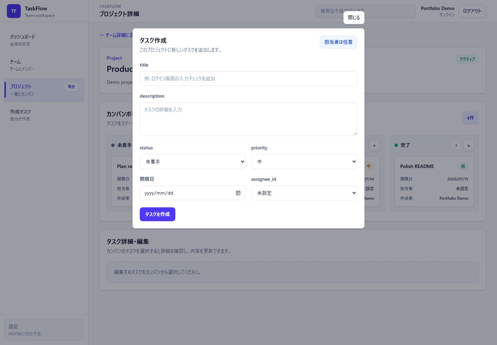
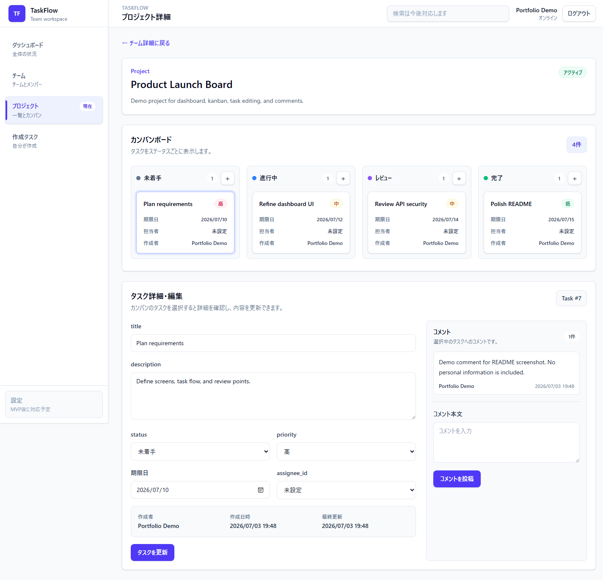
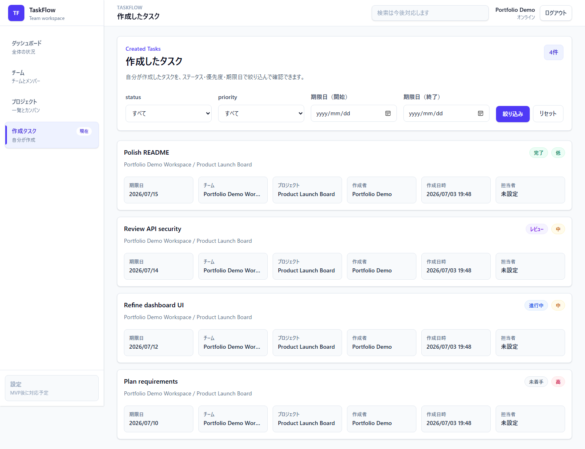

# TaskFlow

TaskFlow は、チームでプロジェクト、タスク、コメントを管理するためのタスク管理 Web アプリです。

Rails API と React SPA で構成し、認証、チーム管理、プロジェクト管理、カンバン形式のタスク管理、コメント、作成したタスク一覧までを MVP として実装しています。将来的には、タスクの自動分解、進捗要約、今日やるべきタスクの提案などの AI 機能を追加する予定です。

## 主な機能

- JWT 認証によるユーザー登録、ログイン、ログアウト
- チーム作成、チーム一覧、チーム詳細、メンバー一覧、メンバー追加
- チームごとのプロジェクト作成、一覧、詳細
- 所属チーム横断のプロジェクト一覧
- プロジェクト詳細での 4 列カンバン表示
- カンバン列の `+` からのタスク作成
- タスク詳細表示、編集、ステータス変更、優先度変更、期限日設定、担当者設定
- コメント一覧、コメント作成
- 自分が作成したタスク一覧と status / priority / 期限日による絞り込み
- ローディング、エラー、空状態、送信中状態の表示
- API レスポンスの非同期競合対策

## 使用技術

### Backend

- Ruby on Rails API
- PostgreSQL
- devise
- devise-jwt
- rack-cors
- RSpec
- FactoryBot
- Faker
- RuboCop
- Brakeman

### Frontend

- React
- TypeScript
- Vite
- Tailwind CSS
- Axios
- React Router
- oxlint

## スクリーンショット

### ログイン



メールアドレスとパスワードでログインします。認証成功後、JWT を保存して API リクエストに付与します。

### ダッシュボード



所属チーム数、プロジェクト数、自分が作成したタスク数、最近使う導線を確認できます。

### チーム一覧



所属チームの一覧を表示し、新しいチームを作成できます。

### チーム詳細



チームのプロジェクト一覧、プロジェクト作成、メンバー一覧、メールアドレスによるメンバー追加を行えます。

### プロジェクト一覧



自分が所属しているチーム内のプロジェクトを、チーム名つきで横断表示します。

### プロジェクト詳細 / カンバン



プロジェクト内のタスクを、未着手、進行中、レビュー、完了の 4 列カンバンで表示します。

### カンバン列からのタスク作成



各カンバン列の `+` からタスク作成モーダルを開き、押した列の status を初期値としてタスクを作成できます。

### タスク詳細・編集 / コメント



タスクカードをクリックすると詳細・編集エリアに表示され、title、description、status、priority、期限日、担当者を更新できます。コメント一覧とコメント作成も同じ画面で行えます。

### 作成したタスク一覧



自分が作成したタスクを一覧表示し、status、priority、期限日の範囲で絞り込めます。

## セキュリティ面で意識したこと

- devise-jwt による Bearer Token 認証を使用
- 認証必須 API は `current_user` 起点でデータ取得と認可を制御
- Team / Project / Task / Comment は、ログインユーザーが所属する Team 経由でスコープを絞る
- 他チームのデータは参照・作成・更新・削除できないように制御
- `user_id` / `created_by_id` はフロントエンドから信用せず、サーバー側で `current_user` を設定
- Task の assignee は対象 Project の Team に所属する User のみに限定
- Strong Parameters で許可した属性のみ受け取る
- API レスポンスに `password` / `encrypted_password` / `jti` を含めない
- CORS は localhost と `FRONTEND_ORIGIN` 環境変数で許可 origin を管理
- `.env`、`master.key`、本物の秘密情報は Git 管理しない
- RSpec / RuboCop / Brakeman で確認する方針

## API 概要

ベースパスは `/api/v1` です。

| 領域 | Method / Path | 説明 |
| --- | --- | --- |
| Auth | `POST /api/v1/auth/sign_up` | ユーザー登録 |
| Auth | `POST /api/v1/auth/sign_in` | ログイン |
| Auth | `DELETE /api/v1/auth/sign_out` | ログアウト |
| Auth | `GET /api/v1/auth/me` | ログインユーザー取得 |
| Team | `GET /api/v1/teams` | 所属チーム一覧 |
| Team | `POST /api/v1/teams` | チーム作成 |
| Team | `GET /api/v1/teams/:id` | チーム詳細 |
| TeamMember | `GET /api/v1/teams/:team_id/members` | メンバー一覧 |
| TeamMember | `POST /api/v1/teams/:team_id/members` | メンバー追加 |
| Project | `GET /api/v1/teams/:team_id/projects` | チーム内プロジェクト一覧 |
| Project | `POST /api/v1/teams/:team_id/projects` | プロジェクト作成 |
| Project | `GET /api/v1/projects/:id` | プロジェクト詳細 |
| Task | `POST /api/v1/projects/:project_id/tasks` | タスク作成 |
| Task | `GET /api/v1/tasks/:id` | タスク詳細 |
| Task | `PATCH /api/v1/tasks/:id` | タスク更新 |
| Comment | `GET /api/v1/tasks/:task_id/comments` | コメント一覧 |
| Comment | `POST /api/v1/tasks/:task_id/comments` | コメント作成 |
| My | `GET /api/v1/my/tasks` | 自分の担当タスク一覧 |
| My | `GET /api/v1/my/created_tasks` | 自分が作成したタスク一覧 |
| Kanban | `GET /api/v1/projects/:project_id/kanban` | Project 内の Task をステータス別に取得 |

## セットアップ方法

### Backend

```powershell
cd D:/RubyProjects/teamtaskapp/backend
bundle install
```

`backend/.env.example` をコピーして `backend/.env` を作成し、ローカル環境の値を設定します。

```env
TASKFLOW_AI_DATABASE_USERNAME=postgres
TASKFLOW_AI_DATABASE_PASSWORD=your_password_here
TASKFLOW_AI_DATABASE_HOST=localhost
TASKFLOW_AI_JWT_SECRET_KEY=your_jwt_secret_key_here
SECRET_KEY_BASE=your_secret_key_base_here
FRONTEND_ORIGIN=http://localhost:5173
```

DB を作成し、マイグレーションを実行します。

```powershell
ruby bin\rails db:create
ruby bin\rails db:migrate
```

### Frontend

```powershell
cd D:/RubyProjects/teamtaskapp/frontend
npm install
```

必要に応じて `frontend/.env.example` を参考に API URL を設定します。

```env
VITE_API_BASE_URL=http://localhost:3000/api/v1
```

## 起動方法

Backend:

```powershell
cd D:/RubyProjects/teamtaskapp/backend
ruby bin\rails server
```

Frontend:

```powershell
cd D:/RubyProjects/teamtaskapp/frontend
npm.cmd run dev
```

デフォルトでは Backend が `http://localhost:3000`、Frontend が `http://localhost:5173` で起動します。

## 確認コマンド

Backend:

```powershell
cd D:/RubyProjects/teamtaskapp/backend
bundle exec rspec
bundle exec rubocop
bundle exec brakeman
```

Frontend:

```powershell
cd D:/RubyProjects/teamtaskapp/frontend
npm.cmd run build
npm.cmd run lint
```

## ディレクトリ構成

```text
.
├── AGENTS.md
├── README.md
├── docs
│   ├── requirements.md
│   ├── database_design.md
│   ├── api_design.md
│   ├── implementation_plan.md
│   ├── frontend_design.md
│   └── screenshots
├── backend
│   └── Rails API application
└── frontend
    └── React SPA application
```

## 設計ドキュメント

- [要件定義](docs/requirements.md)
- [データベース設計](docs/database_design.md)
- [API 設計](docs/api_design.md)
- [実装計画](docs/implementation_plan.md)
- [フロントエンド設計](docs/frontend_design.md)

## 今後の改善予定

- チーム更新、削除 UI
- チームメンバー権限変更、削除 UI
- プロジェクト更新、削除 UI
- タスク削除 UI
- コメント編集、削除
- カンバンのドラッグアンドドロップ
- 通知、横断検索、アクティビティ履歴
- Koyeb + Neon PostgreSQL + Vercel への本番デプロイ
- AI によるタスク分解、進捗要約、今日やるべきタスク提案
