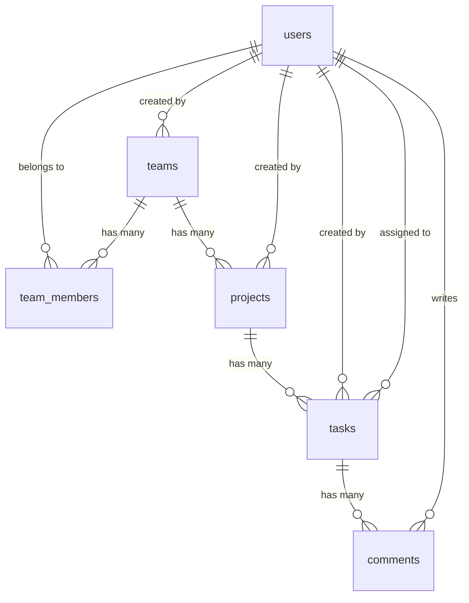

# TaskFlow AI データベース設計

## 基本方針

TaskFlow AI の MVP では、チーム単位でデータを分離します。

Rails 実装時は、モデルのバリデーションだけでなく DB 制約も必ず定義します。アプリケーション側の認可ミスがあっても、外部キー、一意制約、NOT NULL 制約によって不整合を起こしにくい設計にします。

DB は PostgreSQL を使用します。Rails は API モードで構築し、認証には devise-jwt を使用します。

## ER 図



## テーブル一覧

| テーブル | モデル | 目的 |
| --- | --- | --- |
| users | User | 認証ユーザー |
| teams | Team | チーム |
| team_members | TeamMember | ユーザーとチームの所属関係 |
| projects | Project | チーム内のプロジェクト |
| tasks | Task | プロジェクト内のタスク |
| comments | Comment | タスクへのコメント |

## users

認証ユーザーを管理します。

| カラム | 型 | 制約 | 説明 |
| --- | --- | --- | --- |
| id | bigint | PK | ユーザー ID |
| name | string | NOT NULL | 表示名 |
| email | string | NOT NULL | ログイン用メールアドレス |
| password_digest | string | NOT NULL | パスワードハッシュ |
| created_at | datetime | NOT NULL | 作成日時 |
| updated_at | datetime | NOT NULL | 更新日時 |

### インデックス

- `unique index users.lower_email` on `LOWER(email)`

### バリデーション

- name は必須
- email は必須
- email は大文字小文字を区別せず一意
- email は保存前に小文字化する
- password は必須
- password は最小文字数を設定する

### 備考

- Rails 実装時は devise-jwt の利用を想定する
- メールアドレスの一意性はアプリ側と DB 側の両方で保証する
- PostgreSQL では `LOWER(email)` の unique index で case-insensitive unique を保証する

## teams

チームを管理します。

| カラム | 型 | 制約 | 説明 |
| --- | --- | --- | --- |
| id | bigint | PK | チーム ID |
| name | string | NOT NULL | チーム名 |
| description | text |  | チーム説明 |
| created_by_id | bigint | FK, NOT NULL | 作成者ユーザー ID |
| created_at | datetime | NOT NULL | 作成日時 |
| updated_at | datetime | NOT NULL | 更新日時 |

### インデックス

- `index teams.created_by_id`

### 外部キー

- `created_by_id` references `users.id`

### バリデーション

- name は必須
- name は最大文字数を設定する
- created_by は必須

### 備考

- チーム作成時に Team と TeamMember owner を同一トランザクションで作成する
- MVP では owner のみチーム削除を許可する
- チーム削除時は関連する TeamMember、Project、Task、Comment も削除する

## team_members

ユーザーとチームの所属関係、権限を管理します。

| カラム | 型 | 制約 | 説明 |
| --- | --- | --- | --- |
| id | bigint | PK | チームメンバー ID |
| team_id | bigint | FK, NOT NULL | チーム ID |
| user_id | bigint | FK, NOT NULL | ユーザー ID |
| role | string | NOT NULL, default: member | owner, admin, member |
| joined_at | datetime | NOT NULL | 参加日時 |
| created_at | datetime | NOT NULL | 作成日時 |
| updated_at | datetime | NOT NULL | 更新日時 |

### インデックス

- `unique index team_members.team_id, user_id`
- `index team_members.user_id`
- `index team_members.team_id`
- `index team_members.team_id, role`

### 外部キー

- `team_id` references `teams.id`
- `user_id` references `users.id`

### DB 制約

- team_id は NOT NULL
- user_id は NOT NULL
- role は NOT NULL
- role の default は `member`
- joined_at は NOT NULL
- 同一チームに同じユーザーを重複登録できない
- role は `owner`, `admin`, `member` のみ許可する

### バリデーション

- team は必須
- user は必須
- role は必須
- role は定義済みの値のみ許可する
- 同一 team_id と user_id の組み合わせは一意

### 備考

- owner が 0 人になる変更や削除は禁止する
- admin は owner を削除できない
- admin は owner を降格できない
- admin は他メンバーを owner に変更できない
- member はメンバー管理ができない
- メンバー追加時は対象ユーザーが存在することを確認する
- チームメンバー削除時、そのユーザーが担当していた対象チーム内のタスクは削除せず、assignee_id を null に更新する

## projects

チーム内のプロジェクトを管理します。

| カラム | 型 | 制約 | 説明 |
| --- | --- | --- | --- |
| id | bigint | PK | プロジェクト ID |
| team_id | bigint | FK, NOT NULL | 所属チーム ID |
| name | string | NOT NULL | プロジェクト名 |
| description | text |  | プロジェクト説明 |
| status | string | NOT NULL, default: active | active, archived |
| created_by_id | bigint | FK, NOT NULL | 作成者ユーザー ID |
| created_at | datetime | NOT NULL | 作成日時 |
| updated_at | datetime | NOT NULL | 更新日時 |

### インデックス

- `index projects.team_id`
- `index projects.created_by_id`
- `index projects.team_id, status`

### 外部キー

- `team_id` references `teams.id`
- `created_by_id` references `users.id`

### DB 制約

- team_id は NOT NULL
- name は NOT NULL
- status は NOT NULL
- status の default は `active`
- created_by_id は NOT NULL
- status は `active`, `archived` のみ許可する

### バリデーション

- team は必須
- name は必須
- name は最大文字数を設定する
- status は定義済みの値のみ許可する
- created_by は必須

### 備考

- MVP ではプロジェクト削除を対象とし、所属チーム内のメンバーが削除できる
- チーム削除時は関連する Project も削除する
- archived は将来の非表示や終了状態のために用意する

## tasks

プロジェクト内のタスクを管理します。

| カラム | 型 | 制約 | 説明 |
| --- | --- | --- | --- |
| id | bigint | PK | タスク ID |
| project_id | bigint | FK, NOT NULL | 所属プロジェクト ID |
| title | string | NOT NULL | タスク名 |
| description | text |  | タスク説明 |
| status | string | NOT NULL, default: todo | todo, in_progress, review, done |
| priority | string | NOT NULL, default: medium | low, medium, high |
| due_on | date |  | 期限 |
| assignee_id | bigint | FK | 担当者ユーザー ID |
| created_by_id | bigint | FK, NOT NULL | 作成者ユーザー ID |
| created_at | datetime | NOT NULL | 作成日時 |
| updated_at | datetime | NOT NULL | 更新日時 |

### インデックス

- `index tasks.project_id`
- `index tasks.project_id, status`
- `index tasks.assignee_id`
- `index tasks.created_by_id`
- `index tasks.due_on`

### 外部キー

- `project_id` references `projects.id`
- `assignee_id` references `users.id`
- `created_by_id` references `users.id`

### DB 制約

- project_id は NOT NULL
- title は NOT NULL
- status は NOT NULL
- priority は NOT NULL
- status の default は `todo`
- priority の default は `medium`
- created_by_id は NOT NULL
- status は `todo`, `in_progress`, `review`, `done` のみ許可する
- priority は `low`, `medium`, `high` のみ許可する

### バリデーション

- project は必須
- title は必須
- title は最大文字数を設定する
- status は定義済みの値のみ許可する
- priority は定義済みの値のみ許可する
- assignee は未設定を許可する
- assignee を設定する場合、プロジェクトのチームに所属しているユーザーのみ許可する
- created_by は必須
- created_by はプロジェクトのチームに所属しているユーザーのみ許可する

### 備考

- タスクは project 経由で team に所属する
- チーム分離は `current_user.teams` から project をスコープして保証する
- カンバン表示では status ごとにグルーピングする
- チームメンバー削除時は、対象チーム内で assignee_id が削除対象ユーザーのタスクを null にする

## comments

タスクへのコメントを管理します。

| カラム | 型 | 制約 | 説明 |
| --- | --- | --- | --- |
| id | bigint | PK | コメント ID |
| task_id | bigint | FK, NOT NULL | タスク ID |
| user_id | bigint | FK, NOT NULL | 投稿者ユーザー ID |
| content | text | NOT NULL | コメント本文 |
| created_at | datetime | NOT NULL | 作成日時 |
| updated_at | datetime | NOT NULL | 更新日時 |

### インデックス

- `index comments.task_id`
- `index comments.user_id`
- `index comments.task_id, created_at`

### 外部キー

- `task_id` references `tasks.id`
- `user_id` references `users.id`

### DB 制約

- task_id は NOT NULL
- user_id は NOT NULL
- content は NOT NULL

### バリデーション

- task は必須
- user は必須
- content は必須
- content は最大文字数を設定する
- user はタスクが属するプロジェクトのチームに所属している必要がある

### 備考

- MVP ではコメント編集・削除は対象外

## データ分離の設計

チーム配下のデータは、必ず所属チームを起点に取得します。

例:

- Project は `current_user` が所属する Team から取得する
- Task は Team と Project を確認してから取得する
- Comment は Team、Project、Task を確認してから取得する

コントローラでは URL の ID だけで以下のように直接取得しません。

```ruby
Project.find(params[:id])
Task.find(params[:id])
Comment.find(params[:id])
```

代わりに、親リソースをスコープした取得を行います。

```ruby
@team.projects.find(params[:project_id])
@project.tasks.find(params[:id])
@task.comments.order(:created_at)
```

## 削除方針

MVP では Team、TeamMember、Project、Task の削除を対象とします。

| 対象 | MVP での削除 | 方針 |
| --- | --- | --- |
| User | 対象外 | 将来検討 |
| Team | 対象 | owner のみ削除可能。関連する TeamMember、Project、Task、Comment も削除する |
| TeamMember | 対象 | owner 0 人は禁止 |
| Project | 対象 | 所属チーム内のメンバーが削除可能。Team 削除時も関連 Project を削除する |
| Task | 対象 | 紐づくコメントも削除する |
| Comment | 対象外 | タスク削除時のみ一緒に削除される |

### dependent 方針

- Team 削除時は Rails の `dependent: :destroy` により、関連する TeamMember、Project、Task、Comment も削除する
- Project 削除時は Rails の `dependent: :destroy` により、将来紐づく Task、Comment も削除する
- Task 削除時は Rails の `dependent: :destroy` により紐づく Comment も削除する
- TeamMember 削除時は Task を削除せず、対象チーム内の担当タスクの assignee_id を null にする

## 実装時に検討する DB 機能

- User email は保存前に downcase し、PostgreSQL の `LOWER(email)` unique index で case-insensitive unique を保証する
- role、task status、task priority などは Rails 側で enum または validation を使用する
- DB の CHECK 制約で role、status、priority の値を制限することも検討する
- CHECK 制約は、MVP 実装が複雑になりすぎない範囲で導入する
- 外部キーの `on_delete` はデータ保全方針に合わせて明示する
